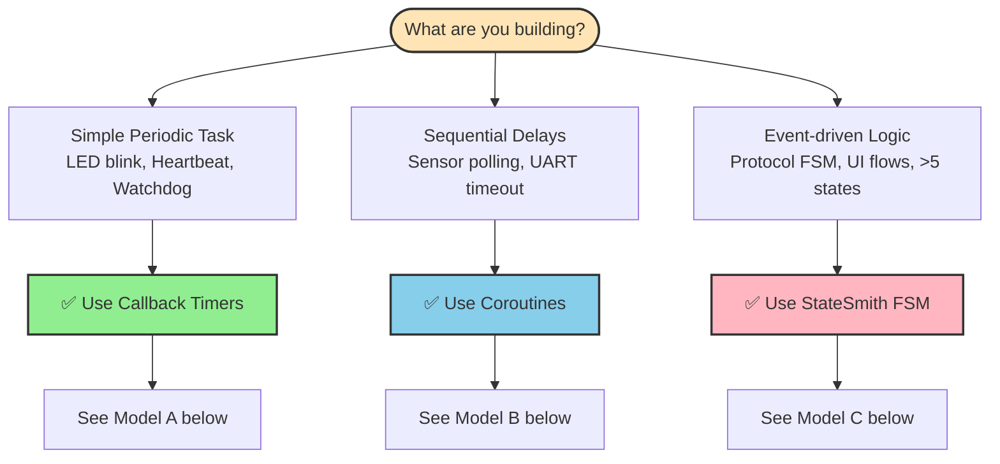
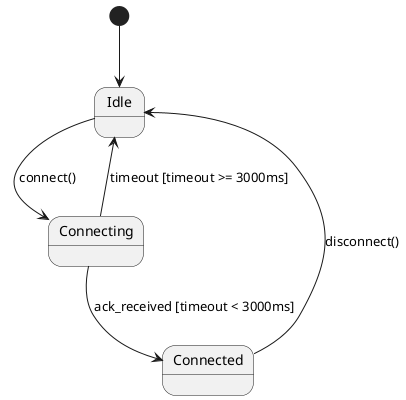

# Quick Start Guide

This guide walks you through integrating SafeTimer into your embedded project in 3 simple steps.

---

## Step 1: Installation

Copy these files to your project directory:

```bash
# Step 1: Copy required files (4 files)
cp SafeTimer/include/safetimer.h your_project/
cp SafeTimer/include/safetimer_config.h your_project/
cp SafeTimer/include/bsp.h your_project/
cp SafeTimer/src/safetimer.c your_project/

# Step 2 (Optional): Copy helper API if needed
cp SafeTimer/include/safetimer_helpers.h your_project/
```

**File Summary:**
- ✅ **Required (4 files):** safetimer.h, safetimer_config.h, bsp.h, safetimer.c
- ✅ **Optional (1 file):** safetimer_helpers.h (convenience API, v1.1+)

---

## Step 2: Implement BSP (3 Functions)

Create `safetimer_bsp.c` with these 3 functions:

> **💡 Naming Tip:** We recommend `safetimer_bsp.c` to avoid conflicts with other libraries. Alternatively, use `myapp_bsp.c` or place in a subdirectory like `bsp/safetimer.c`.

```c
#include "bsp.h"

static volatile bsp_tick_t s_ticks = 0;

/* Called by hardware timer interrupt every 1ms */
void timer_isr(void) {
    s_ticks++;
}

bsp_tick_t bsp_get_ticks(void) {
    return s_ticks;
}

void bsp_enter_critical(void) {
    EA = 0;  /* Disable interrupts */
}

void bsp_exit_critical(void) {
    EA = 1;  /* Enable interrupts */
}
```

**BSP Function Requirements:**
- `bsp_get_ticks()`: Return milliseconds since boot (32-bit tick counter)
- `bsp_enter_critical()`: Disable interrupts (atomic operations)
- `bsp_exit_critical()`: Enable interrupts

See [`examples/`](../examples/) for complete BSP implementations.

---

## Step 3: Choose Your Programming Model

SafeTimer supports **three programming models**. Choose based on your task complexity:

### 🎯 Decision Flowchart



### 📊 Quick Comparison

| Model | Best For | Example | Complexity |
|-------|----------|---------|------------|
| **Callback Timers** | Periodic tasks | LED blink, heartbeat | ⭐ Simple |
| **Coroutines** | Sequential delays | Sensor polling, UART timeout | ⭐⭐ Medium |
| **StateSmith FSM** | State machines | Protocol handlers, UI flows | ⭐⭐⭐ Advanced |

**💡 Pro Tip:** You can mix all three models in one application! See [Coroutines Tutorial](coroutines.md#mixed-mode-architecture) for examples.

---

## Step 4: Implement Your Chosen Model

### Model A: Callback Timers (Most Common)

**Use when:** Simple periodic tasks without complex state.

#### Basic Usage (Core API)

```c
#include "safetimer.h"

void led_callback(void *user_data) {
    toggle_led();  /* User code */
}

int main(void) {
    /* Initialize hardware timer (1ms tick) */
    init_timer0();

    /* Create a 1000ms repeating timer */
    safetimer_handle_t led_timer = safetimer_create(
        1000,                    /* period_ms */
        TIMER_MODE_REPEAT,       /* mode */
        led_callback,            /* callback */
        NULL                     /* user_data */
    );

    safetimer_start(led_timer);

    /* Main loop */
    while (1) {
        safetimer_process();  /* Process timers */
    }
}
```

---

### Simpler Alternative (Helper API, v1.1+)

For common immediate-start scenarios, use the optional helper API:

```c
#include "safetimer_helpers.h"  /* Optional convenience layer */

int main(void) {
    init_timer0();

    /* Create and start in one line (zero overhead) */
    safetimer_handle_t led_timer = safetimer_create_started(
        1000, TIMER_MODE_REPEAT, led_callback, NULL
    );

    if (led_timer == SAFETIMER_INVALID_HANDLE) {
        /* Handle error */
    }

    while (1) {
        safetimer_process();
    }
}
```

**When to Use Which API:**
- 📦 **Core API** (`safetimer.h`): Cascaded timers, conditional start
- ⚡ **Helper API** (`safetimer_helpers.h`): Immediate start (90% of use cases)

See [`examples/helpers_demo/`](../examples/helpers_demo/) for detailed comparison.

---

### Model B: Coroutines (v1.3.0+)

**Use when:** Linear sequences with delays (sensor init → warmup → read → transmit).

SafeTimer supports **stackless coroutines** (Protothread-style) for linear async programming. Perfect for UART timeouts, sensor polling, and multi-step initialization.

#### Quick Example

```c
#include "safetimer.h"
#include "safetimer_coro.h"

typedef struct {
    SAFETIMER_CORO_CONTEXT;  /* Must be first member */
    int counter;
} my_coro_ctx_t;

void led_blink_coro(void *user_data) {
    my_coro_ctx_t *ctx = (my_coro_ctx_t *)user_data;

    SAFETIMER_CORO_BEGIN(ctx);

    while (1) {
        led_on();
        SAFETIMER_CORO_SLEEP(100);   /* LED on for 100ms */

        led_off();
        SAFETIMER_CORO_SLEEP(900);   /* LED off for 900ms */

        ctx->counter++;
    }

    SAFETIMER_CORO_END();
}

int main(void) {
    static my_coro_ctx_t ctx = {0};

    init_timer0();

    /* Create coroutine timer (MUST use TIMER_MODE_REPEAT) */
    safetimer_handle_t h = safetimer_create(
        10, TIMER_MODE_REPEAT, led_blink_coro, &ctx
    );
    ctx._coro_handle = h;  /* Store handle for SLEEP/WAIT_UNTIL */
    safetimer_start(h);

    while (1) {
        safetimer_process();
    }
}
```

**Coroutine Macros:**
- `SAFETIMER_CORO_SLEEP(ms)` - Sleep for specified milliseconds
- `SAFETIMER_CORO_WAIT_UNTIL(cond, poll_ms)` - Wait until condition is true
- `SAFETIMER_CORO_YIELD()` - Explicit yield
- `SAFETIMER_CORO_RESET()` - Restart coroutine from beginning
- `SAFETIMER_CORO_EXIT()` - Exit coroutine permanently

**✅ Good Use Cases:**
- UART communication with timeouts
- Sensor polling sequences (init → warmup → read)
- Multi-step initialization flows

**❌ Avoid For:**
- Simple periodic tasks (use callbacks)
- Complex event-driven logic (use StateSmith FSM)

See [Coroutines Tutorial](coroutines.md) for complete guide with semaphores.

---

### Model C: StateSmith FSM (Advanced)

**Use when:** Complex event-driven logic with multiple states (>5 states, protocol handlers, UI flows).

[StateSmith](https://github.com/StateSmith/StateSmith) generates efficient C code from UML state diagrams. SafeTimer provides the **clock source** for FSM tick events.

#### Integration Pattern

**Step 1: Define State Machine (PlantUML)**



**Step 2: Generate C Code**

```bash
statesmith generate protocol.plantuml
# Generates: protocol_fsm.h, protocol_fsm.c
```

**Step 3: Integrate with SafeTimer**

```c
#include "safetimer.h"
#include "protocol_fsm.h"  /* StateSmith-generated */

static protocol_fsm_t g_fsm;

/* Timer callback: dispatch tick event to FSM */
void fsm_tick_callback(void *user_data) {
    protocol_fsm_t *fsm = (protocol_fsm_t *)user_data;
    protocol_fsm_dispatch(fsm, PROTOCOL_FSM_EVENT_TICK);
}

int main(void) {
    init_timer0();
    protocol_fsm_init(&g_fsm);

    /* Create 100ms tick timer for FSM */
    safetimer_handle_t h_fsm = safetimer_create(
        100, TIMER_MODE_REPEAT, fsm_tick_callback, &g_fsm
    );
    safetimer_start(h_fsm);

    while (1) {
        safetimer_process();

        /* External events can be dispatched directly */
        if (button_pressed()) {
            protocol_fsm_dispatch(&g_fsm, PROTOCOL_FSM_EVENT_CONNECT);
        }
    }
}
```

**✅ Good Use Cases:**
- Protocol state machines (UART, I2C, SPI)
- UI state management (menu navigation, screens)
- Complex event-driven logic (>5 states)

**❌ Avoid For:**
- Simple periodic tasks (use callbacks)
- Linear sequences (use coroutines)

See [Coroutines Tutorial - StateSmith Integration](coroutines.md#statesmith-integration) for complete examples.

---

## Next Steps

- **Configuration:** [Configuration & Tuning](configuration-and-tuning.md)
- **Real-world Examples:** [Use Cases & Best Practices](use-cases.md)
- **Hardware Porting:** [BSP Porting Guide](bsp-porting.md)
- **API Reference:** See `include/safetimer.h` for complete API documentation
