# Quick Start Guide

This guide walks you through integrating SafeTimer into your embedded project in 3 simple steps.

---

## Step 1: Installation

Copy these files to your project directory:

```bash
# Step 1: Copy required files (4 files)
cp SafeTimer/include/safetimer.h your_project/
cp SafeTimer/include/safetimer_config.h your_project/
cp SafeTimer/include/bsp.h your_project/
cp SafeTimer/src/safetimer.c your_project/

# Step 2 (Optional): Copy helper API if needed
cp SafeTimer/include/safetimer_helpers.h your_project/
```

**File Summary:**
- ✅ **Required (4 files):** safetimer.h, safetimer_config.h, bsp.h, safetimer.c
- ✅ **Optional (1 file):** safetimer_helpers.h (convenience API, v1.1+)

---

## Step 2: Implement BSP (3 Functions)

Create `safetimer_bsp.c` with these 3 functions:

> **💡 Naming Tip:** We recommend `safetimer_bsp.c` to avoid conflicts with other libraries. Alternatively, use `myapp_bsp.c` or place in a subdirectory like `bsp/safetimer.c`.

```c
#include "bsp.h"

static volatile bsp_tick_t s_ticks = 0;

/* Called by hardware timer interrupt every 1ms */
void timer_isr(void) {
    s_ticks++;
}

bsp_tick_t bsp_get_ticks(void) {
    return s_ticks;
}

void bsp_enter_critical(void) {
    EA = 0;  /* Disable interrupts */
}

void bsp_exit_critical(void) {
    EA = 1;  /* Enable interrupts */
}
```

**BSP Function Requirements:**
- `bsp_get_ticks()`: Return milliseconds since boot (32-bit tick counter)
- `bsp_enter_critical()`: Disable interrupts (atomic operations)
- `bsp_exit_critical()`: Enable interrupts

See [`examples/`](../examples/) for complete BSP implementations.

---

## Step 3: Understanding Programming Models

SafeTimer supports **three complementary programming models**. They work together - most applications use all three for different tasks:

- **Callbacks** for stateless periodic tasks
- **Coroutines** for linear sequences
- **StateSmith FSM** for state-driven logic

**Key Point:** These are **tools in your toolbox**, not mutually exclusive choices. Pick the right tool for each task.

### 🎯 Decision Flowchart

```mermaid
flowchart TD
    Start([What are you building?])

    Start --> Simple[Pure Periodic Task<br/>LED blink, Heartbeat<br/>No state tracking needed]
    Start --> Sequential[Linear Sequence<br/>Sensor: init → warmup → read<br/>Multiple steps, no branching]
    Start --> StateMachine[Has States & Events<br/>Button press, Protocol handler<br/>UI flow, Device modes]
    Start --> Mixed[Multiple Task Types<br/>IoT device, Industrial controller]

    Simple --> ModelA[✅ Use Callback Timers]
    Sequential --> ModelB[✅ Use Coroutines]
    StateMachine --> ModelC[✅ Use StateSmith FSM]
    Mixed --> ModelMix[✅ Mix Models]

    ModelA --> ImplA[See Model A below]
    ModelB --> ImplB[See Model B below]
    ModelC --> ImplC[See Model C below]
    ModelMix --> ImplMix[See Mixed-Mode Example]

    style ModelA fill:#90EE90,stroke:#333,stroke-width:2px
    style ModelB fill:#87CEEB,stroke:#333,stroke-width:2px
    style ModelC fill:#FFB6C1,stroke:#333,stroke-width:2px
    style ModelMix fill:#DDA0DD,stroke:#333,stroke-width:2px
    style Start fill:#FFE4B5,stroke:#333,stroke-width:2px
```



### 📊 Tool Selection Guide

| Tool | Solves | Example | Typical Usage |
|------|--------|---------|---------------|
| **Callback Timers** | Stateless periodic actions | LED blink, heartbeat | ~20% of tasks |
| **Coroutines** | Linear multi-step sequences | Sensor: init → warmup → read | ~30% of tasks |
| **StateSmith FSM** | State & event handling | Button press, protocol, UI | ~50% of tasks |

**💡 Reality Check:** Most real applications use **all three together**. A typical IoT device might have:
- 2-3 callback timers (heartbeat, status LED)
- 1-2 coroutines (sensor polling, data transmission)
- 2-5 state machines (button handling, protocol, power management)

---

### 🎨 Combining Models (The Normal Way)

**Mixing models is not "advanced" - it's the standard approach.** Each timer is independent, so you naturally use the right tool for each task.

#### Mixed-Mode Example

```c
int main(void) {
    init_timer0();

    /* Model A: Callback for simple periodic task */
    safetimer_create_started(1000, TIMER_MODE_REPEAT, heartbeat_send, NULL);

    /* Model B: Coroutine for sensor polling sequence */
    static sensor_ctx_t sensor_ctx = {0};
    safetimer_handle_t h_sensor = safetimer_create(
        10, TIMER_MODE_REPEAT, sensor_coro, &sensor_ctx
    );
    sensor_ctx._coro_handle = h_sensor;
    safetimer_start(h_sensor);

    /* Model C: StateSmith FSM for protocol handling */
    static protocol_fsm_t protocol_fsm = {0};
    protocol_fsm_init(&protocol_fsm);
    safetimer_create_started(100, TIMER_MODE_REPEAT, protocol_fsm_tick, &protocol_fsm);

    while (1) {
        safetimer_process();  /* Processes all timers */
    }
}
```

#### Real-World Examples

| Application Type | Natural Tool Mix | Why Each Tool? |
|------------------|------------------|----------------|
| **IoT Device** | All three | Heartbeat (callback), sensor polling (coroutine), network protocol (FSM) |
| **Industrial Controller** | Callbacks + FSM | Status LED (callback), control logic & safety interlocks (FSM) |
| **Smart Sensor** | Coroutines + FSM | Sensor sequence (coroutine), power modes & button (FSM) |
| **Simple Appliance** | Callbacks + FSM | Timer display (callback), user interface (FSM) |

**💡 Design Approach:**
1. Start by identifying your tasks
2. Pick the natural tool for each task
3. Don't force everything into one model

See [Coroutines Tutorial](coroutines.md#mixed-mode-architecture) for detailed examples.

---

## Step 4: Implementation Examples

Below are examples for each model. Remember: you'll typically use multiple models in one application.

### Model A: Callback Timers

**Use when:** Stateless periodic actions - no state tracking needed.

#### Basic Usage (Core API)

```c
#include "safetimer.h"

void led_callback(void *user_data) {
    toggle_led();  /* User code */
}

int main(void) {
    /* Initialize hardware timer (1ms tick) */
    init_timer0();

    /* Create a 1000ms repeating timer */
    safetimer_handle_t led_timer = safetimer_create(
        1000,                    /* period_ms */
        TIMER_MODE_REPEAT,       /* mode */
        led_callback,            /* callback */
        NULL                     /* user_data */
    );

    if (led_timer == SAFETIMER_INVALID_HANDLE) {
        /* Handle error: timer pool full */
        error_handler();
    }

    safetimer_start(led_timer);

    /* Main loop */
    while (1) {
        safetimer_process();  /* Process timers */
    }
}
```

---

### Simpler Alternative (Helper API, v1.1+)

For common immediate-start scenarios, use the optional helper API:

```c
#include "safetimer_helpers.h"  /* Optional convenience layer */

int main(void) {
    init_timer0();

    /* Create and start in one line (zero overhead) */
    safetimer_handle_t led_timer = safetimer_create_started(
        1000, TIMER_MODE_REPEAT, led_callback, NULL
    );

    if (led_timer == SAFETIMER_INVALID_HANDLE) {
        /* Handle error */
    }

    while (1) {
        safetimer_process();
    }
}
```

**When to Use Which API:**
- 📦 **Core API** (`safetimer.h`): Cascaded timers, conditional start
- ⚡ **Helper API** (`safetimer_helpers.h`): Immediate start (90% of use cases)

See [`examples/helpers_demo/`](../examples/helpers_demo/) for detailed comparison.

---

### Model B: Coroutines (v1.3.0+)

**Use when:** Linear multi-step sequences with delays between steps.

SafeTimer supports **stackless coroutines** (Protothread-style) for linear async programming. Perfect for UART timeouts, sensor polling, and multi-step initialization.

**Setup:** No configuration needed - just include the header:
```c
#include "safetimer_coro.h"  // Enables coroutine macros
```

#### Quick Example

```c
#include "safetimer.h"
#include "safetimer_coro.h"

typedef struct {
    SAFETIMER_CORO_CONTEXT;  /* Must be first member */
    int counter;
} my_coro_ctx_t;

void led_blink_coro(void *user_data) {
    my_coro_ctx_t *ctx = (my_coro_ctx_t *)user_data;

    SAFETIMER_CORO_BEGIN(ctx);

    while (1) {
        led_on();
        SAFETIMER_CORO_SLEEP(100);   /* LED on for 100ms */

        led_off();
        SAFETIMER_CORO_SLEEP(900);   /* LED off for 900ms */

        ctx->counter++;
    }

    SAFETIMER_CORO_END();
}

int main(void) {
    static my_coro_ctx_t ctx = {0};

    init_timer0();

    /* Create coroutine timer (MUST use TIMER_MODE_REPEAT) */
    safetimer_handle_t h = safetimer_create(
        10, TIMER_MODE_REPEAT, led_blink_coro, &ctx
    );
    ctx._coro_handle = h;  /* Store handle for SLEEP/WAIT_UNTIL */
    safetimer_start(h);

    while (1) {
        safetimer_process();
    }
}
```

**Coroutine Macros:**
- `SAFETIMER_CORO_SLEEP(ms)` - Sleep for specified milliseconds
- `SAFETIMER_CORO_WAIT_UNTIL(cond, poll_ms)` - Wait until condition is true
- `SAFETIMER_CORO_YIELD()` - Explicit yield
- `SAFETIMER_CORO_RESET()` - Restart coroutine from beginning
- `SAFETIMER_CORO_EXIT()` - Exit coroutine permanently

**✅ Good Use Cases:**
- UART communication with timeouts
- Sensor polling sequences (init → warmup → read)
- Multi-step initialization flows

**❌ Avoid For:**
- Simple periodic tasks (use callbacks)
- Complex event-driven logic (use StateSmith FSM)

See [Coroutines Tutorial](coroutines.md) for complete guide with semaphores.

---

### Model C: StateSmith FSM (Recommended for Most Apps)

**Use when:** Any logic with states and events - from simple button debounce to complex protocols.

**Why FSM?** State machines make code **self-documenting** and **bug-resistant**. Even 2-3 state logic is clearer as FSM than scattered if-else.

[StateSmith](https://github.com/StateSmith/StateSmith) generates efficient C code from UML state diagrams. SafeTimer provides the **clock source** for FSM tick events.

#### Integration Pattern

**Step 1: Define State Machine**

StateSmith uses UML state diagrams to generate C code. See the [official documentation](https://github.com/StateSmith/StateSmith/wiki/Behaviors) for syntax and examples.

**Example state machine definition:**
- Define states (Idle, Connecting, Connected)
- Define transitions with events and guards
- Add entry/exit actions and internal behaviors

**Step 2: Generate C Code**

Use StateSmith CLI to generate C code from your state machine definition. See [CLI Usage](https://github.com/StateSmith/StateSmith/wiki/CLI:-Usage) for details.

```bash
statesmith run --file protocol.csx
# Generates: protocol_fsm.h, protocol_fsm.c
```

**Step 3: Integrate with SafeTimer**

```c
#include "safetimer.h"
#include "protocol_fsm.h"  /* StateSmith-generated */

static protocol_fsm_t g_fsm;

/* Timer callback: dispatch tick event to FSM */
void fsm_tick_callback(void *user_data) {
    protocol_fsm_t *fsm = (protocol_fsm_t *)user_data;
    protocol_fsm_dispatch(fsm, PROTOCOL_FSM_EVENT_TICK);
}

int main(void) {
    init_timer0();
    protocol_fsm_init(&g_fsm);

    /* Create 100ms tick timer for FSM */
    safetimer_handle_t h_fsm = safetimer_create(
        100, TIMER_MODE_REPEAT, fsm_tick_callback, &g_fsm
    );
    safetimer_start(h_fsm);

    while (1) {
        safetimer_process();

        /* External events can be dispatched directly */
        if (button_pressed()) {
            protocol_fsm_dispatch(&g_fsm, PROTOCOL_FSM_EVENT_CONNECT);
        }
    }
}
```

**✅ Good Use Cases (Most Applications!):**
- **Button handling:** Debounce, single/double/long press detection (even simple debounce is clearer as FSM)
- **Protocol handlers:** UART, I2C, SPI communication with timeouts
- **UI flows:** Menu navigation, screen transitions, user interactions
- **Device control:** Power management, mode switching, error recovery
- **Simple logic:** Even 2-3 state logic (idle/active/error) benefits from FSM clarity

**Example: Button Debounce FSM (3 states)**
```
States: IDLE → PRESSED → DEBOUNCING
Events: button_down, button_up, timeout
Result: Clear, testable, no hidden bugs
```

**❌ Avoid For:**
- Pure periodic tasks with no state (use callbacks: LED blink, heartbeat)
- Strictly linear sequences (use coroutines: sensor init → read → transmit)

See [Coroutines Tutorial - StateSmith Integration](coroutines.md#statesmith-integration) for complete examples.

---

## Next Steps

- **Configuration:** [Configuration & Tuning](configuration-and-tuning.md)
- **Real-world Examples:** [Use Cases & Best Practices](use-cases.md)
- **Hardware Porting:** [BSP Porting Guide](bsp-porting.md)
- **API Reference:** See `include/safetimer.h` for complete API documentation
